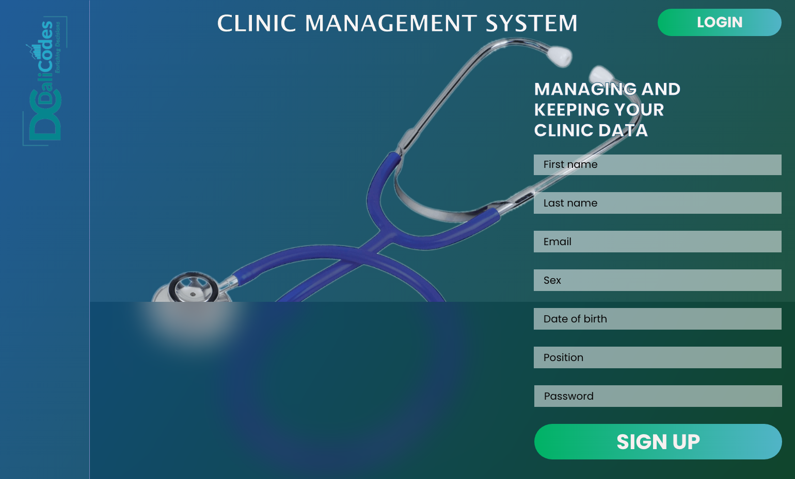
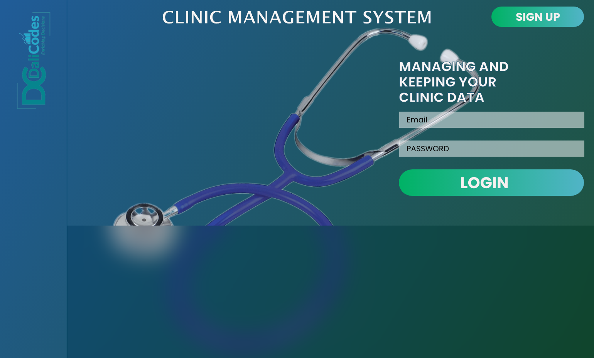
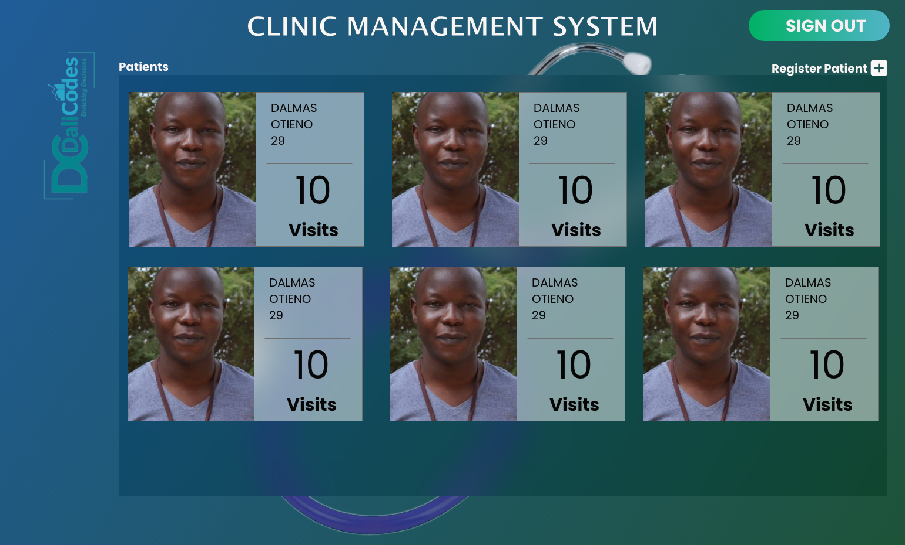
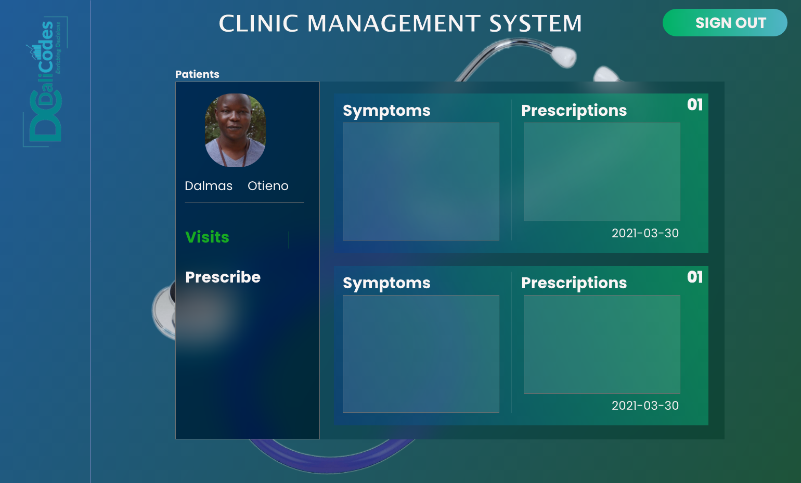
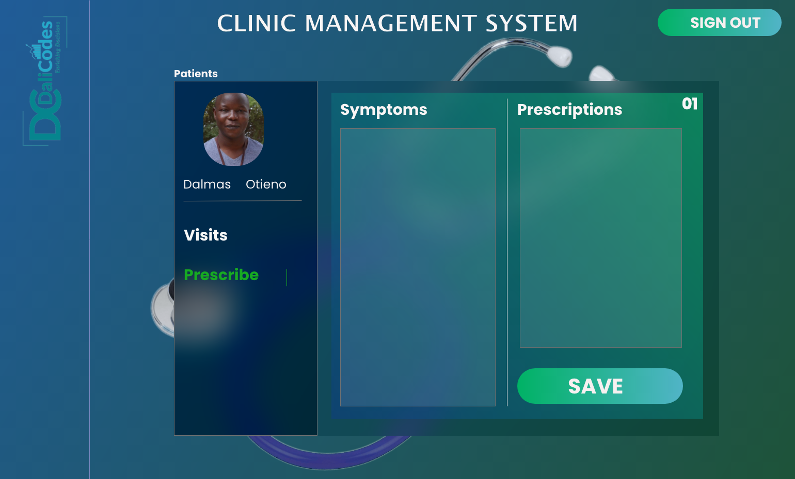
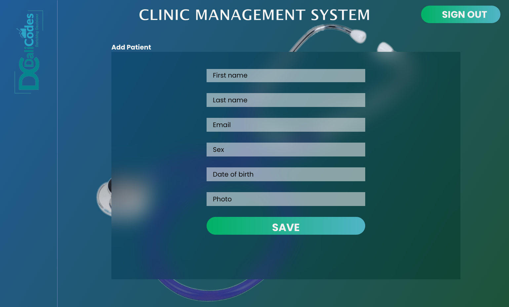

# clinic_management_client

## What I learnt in this project with resources

#### Javascript promises

- <https://web.dev/promises/?gclid=CjwKCAjwrPCGBhALEiwAUl9X08B_SmjkG_c731Qg8Dl40p1KLlIap-5eqP0dxLkKHlJOxocJhIcDvhoCi-IQAvD_BwE>
- <https://www.youtube.com/watch?v=DHvZLI7Db8E&ab_channel=WebDevSimplified>

#### CSS Flex Box resources

- <https://css-tricks.com/snippets/css/a-guide-to-flexbox/#background>

#### Other resources

- css glass effect <https://www.youtube.com/watch?v=O7WbVj5apxU&ab_channel=DevEd>
- css input element animation <https://www.youtube.com/watch?v=IxRJ8vplzAo&t=207s&ab_channel=DevEd>

# Front end designs

These are my first designs. You can guide me the right way.













## Project setup

```
npm install
```

### Compiles and hot-reloads for development

```
npm run serve
```

### Compiles and minifies for production

```
npm run build
```

### Lints and fixes files

```
npm run lint
```

### Customize configuration

See [Configuration Reference](https://cli.vuejs.org/config/).
